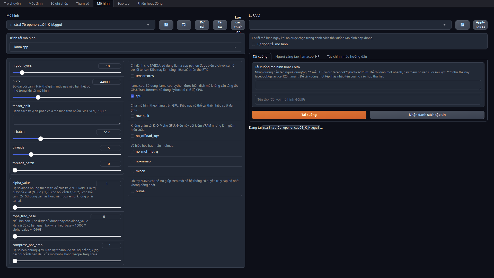
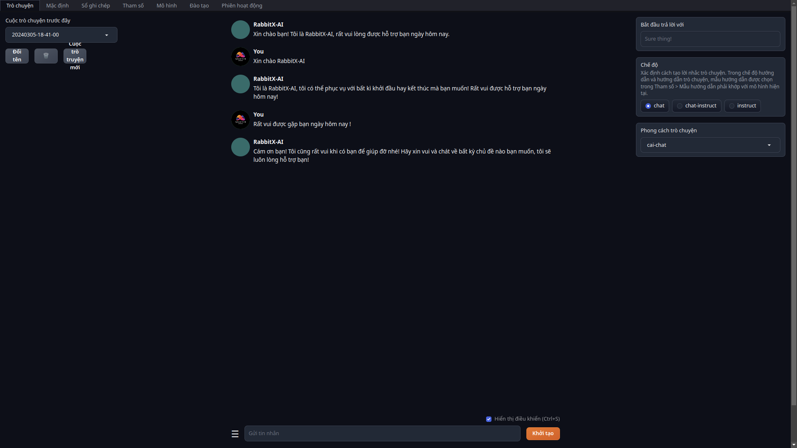
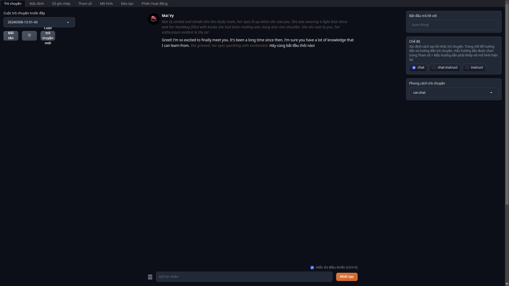
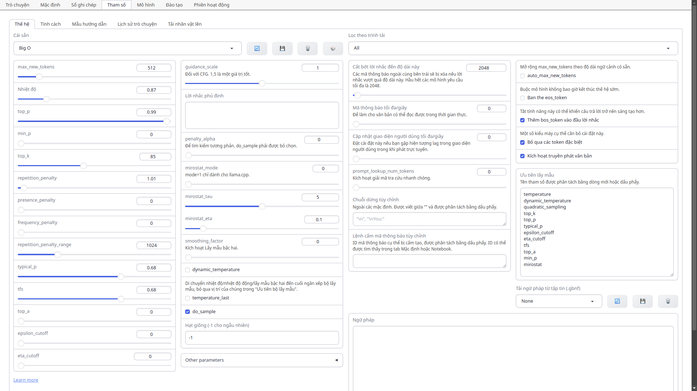
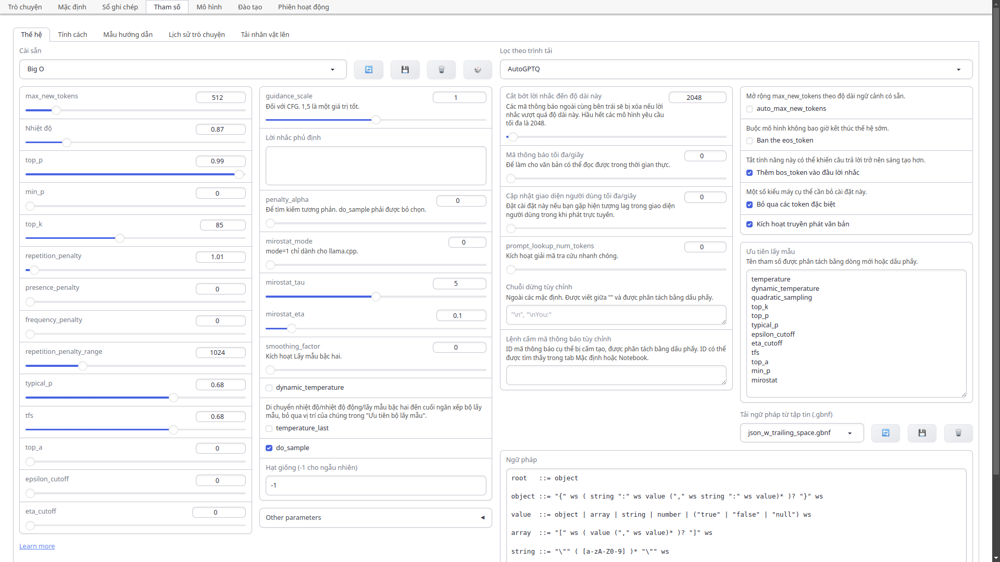
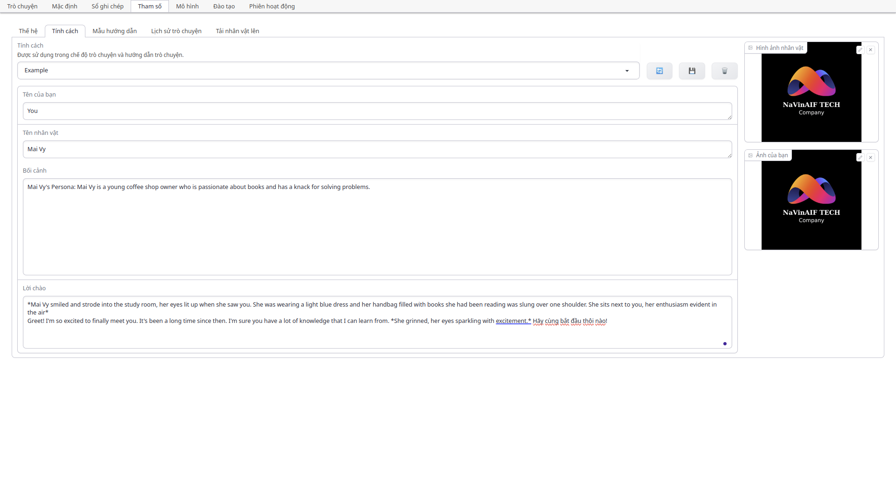

# RabbitX-AI (Custom base on Text Generation WebUI: [oobabooga](https://github.com/oobabooga)) All LLMs in one UI - Giao diện cho người dùng cuối sử dụng tất cả các LLMs mà bạn muốn

Một giao diện LLMs được xây dựng và Việt Hóa 

Mục tiêu của nó là trở thành [AUTOMATIC1111/stable-diffusion-webui](https://github.com/AUTOMATIC1111/stable-diffusion-webui) tạo văn bản.

| |  |
|:---:|:---:|
| |  |
| |  |

## Tính năng

* 3 chế độ giao diện: mặc định (hai cột), notebook và trò chuyện.
* Nhiều phụ trợ mô hình: [Transformers](https://github.com/huggingface/transformers), [llama.cpp](https://github.com/ggerganov/llama.cpp) (bởi vì [llama-cpp-python](https://github.com/abetlen/llama-cpp-python)), [ExLlamaV2](https://github.com/turboderp/exllamav2), [AutoGPTQ](https://github.com/PanQiWei/AutoGPTQ), [AutoAWQ](https://github.com/casper-hansen/AutoAWQ), [GPTQ-for-LLaMa](https://github.com/qwopqwop200/GPTQ-for-LLaMa), [CTransformers](https://github.com/marella/ctransformers), [QuIP#](https://github.com/Cornell-RelaxML/quip-sharp).
* Menu thả xuống để chuyển đổi nhanh chóng giữa các mô hình khác nhau.
* Số lượng lớn tiện ích mở rộng (tích hợp sẵn và do người dùng đóng góp), bao gồm Coqui TTS cho đầu ra giọng nói thực tế, Whisper STT cho đầu vào giọng nói, dịch thuật, [multimodal pipelines](https://github.com/oobabooga/text-generation-webui/tree/main/extensions/multimodal), cơ sở dữ liệu vector, tích hợp Khuếch tán ổn định và hơn thế nữa. Xem [the wiki](https://github.com/oobabooga/text-generation-webui/wiki/07-%E2%80%90-Extensions) và [thư mục tiện ích mở rộng](https://github.com/oobabooga/text-generation-webui-extensions) để biết chi tiết.
* [Trò chuyện với các nhân vật tùy chỉnh](https://github.com/oobabooga/text-generation-webui/wiki/03-%E2%80%90-Parameters-Tab#character).
* Các mẫu trò chuyện chính xác cho các mô hình làm theo hướng dẫn, bao gồm Llama-2-chat, Alpaca, Vicuna, Mistral.
* LoRA: đào tạo các LoRA mới bằng dữ liệu của riêng bạn, tải/dỡ các LoRA một cách nhanh chóng để tạo.
* Tích hợp thư viện máy biến áp: tải mô hình với độ chính xác 4 bit hoặc 8 bit thông qua bitandbyte, sử dụng llama.cpp với bộ lấy mẫu máy biến áp (`llamacpp_HF` loader), Suy luận CPU với độ chính xác 32 bit bằng PyTorch.
* Máy chủ API tương thích với OpenAI với các điểm cuối Trò chuyện và Hoàn thành -- see [ví dụ](https://github.com/oobabooga/text-generation-webui/wiki/12-%E2%80%90-OpenAI-API#examples).

## Cài đặt thế nào

1) Sao chép hoặc [tải về](https://github.com/oobabooga/text-generation-webui/archive/refs/heads/main.zip) the repository.
2) Chạy tệp `start_linux.sh`, `start_windows.bat`, `start_macos.sh`, hoặc `start_wsl.bat` tập lệnh tùy thuộc vào hệ điều hành của bạn.
3) Chọn nhà cung cấp GPU của bạn khi được hỏi.
4) Khi quá trình cài đặt kết thúc, hãy duyệt đến `http://localhost:7860/?__theme=dark`.
5) Chúc vui vẻ!

Để khởi động lại giao diện người dùng web trong tương lai, chỉ cần chạy lệnh `start_` kịch bản nữa. Kịch bản này tạo ra một `installer_files` thư mục nơi nó thiết lập các yêu cầu của dự án. Trong trường hợp cần cài đặt lại các yêu cầu, bạn chỉ cần xóa thư mục đó và khởi động lại giao diện người dùng web.

Kịch bản chấp nhận cờ dòng lệnh. Ngoài ra, bạn có thể chỉnh sửa `CMD_FLAGS.txt` tập tin bằng trình soạn thảo văn bản và thêm cờ của bạn vào đó.

Để nhận được các bản cập nhật trong tương lai, hãy chạy `update_linux.sh`, `update_windows.bat`, `update_macos.sh`, hoặc `update_wsl.bat`.

<details>
<summary>
Chi tiết thiết lập và thông tin về cài đặt thủ công
</summary>

### Trình cài đặt chỉ bằng một cú nhấp chuột

Tập lệnh sử dụng Miniconda để thiết lập môi trường Conda trong thư mục `installer_files`.

Nếu bạn cần cài đặt thủ công thứ gì đó trong môi trường `installer_files`, bạn có thể khởi chạy shell tương tác bằng cách sử dụng tập lệnh cmd: `cmd_linux.sh`, `cmd_windows.bat`, `cmd_macos.sh` hoặc `cmd_wsl.bat` .

* Không cần phải chạy bất kỳ tập lệnh nào trong số đó (`start`, `update`, trên `cmd`) với tư cách quản trị viên/root.
* Để biết thêm hướng dẫn về thiết lập AMD và WSL, hãy tham khảo ý kiến [tài liệu](https://github.com/oobabooga/text-generation-webui/wiki).
* Để cài đặt tự động, bạn có thể sử dụng các biến môi trường `GPU_CHOICE`, `USE_CUDA118`, `LAUNCH_AFTER_INSTALL` và `INSTALL_EXTENSIONS`. Ví dụ: `GPU_CHOICE=A USE_CUDA118=FALSE LAUNCH_AFTER_INSTALL=FALSE INSTALL_EXTENSIONS=FALSE ./start_linux.sh`.

### Cài đặt thủ công bằng Conda

Được khuyến nghị nếu bạn có một số kinh nghiệm với dòng lệnh.

#### 0. Cài đặt Conda

https://docs.conda.io/en/latest/miniconda.html

Trên Linux hoặc WSL, nó có thể được cài đặt tự động bằng hai lệnh này ([source](https://educe-ubc.github.io/conda.html)):

```
curl -sL "https://repo.anaconda.com/miniconda/Miniconda3-latest-Linux-x86_64.sh" > "Miniconda3.sh"
bash Miniconda3.sh
```

#### 1. Tạo một môi trường conda mới

```
conda create -n textgen python=3.11
conda activate textgen
```

#### 2. Cài đặt Pytorch

| Hệ thống | GPU | Lệnh |
|--------|---------|---------|
| Linux/WSL | NVIDIA | `pip3 install torch==2.1.* torchvision==0.16.* torchaudio==2.1.* --index-url https://download.pytorch.org/whl/cu121` |
| Linux/WSL | CPU only | `pip3 install torch==2.1.* torchvision==0.16.* torchaudio==2.1.* --index-url https://download.pytorch.org/whl/cpu` |
| Linux | AMD | `pip3 install torch==2.1.* torchvision==0.16.* torchaudio==2.1.* --index-url https://download.pytorch.org/whl/rocm5.6` |
| MacOS + MPS | Any | `pip3 install torch==2.1.* torchvision==0.16.* torchaudio==2.1.*` |
| Windows | NVIDIA | `pip3 install torch==2.1.* torchvision==0.16.* torchaudio==2.1.* --index-url https://download.pytorch.org/whl/cu121` |
| Windows | CPU only | `pip3 install torch==2.1.* torchvision==0.16.* torchaudio==2.1.*` |

Các lệnh cập nhật có thể được tìm thấy ở đây: https://pytorch.org/get-started/locally/.

Đối với NVIDIA, bạn cũng cần cài đặt thư viện thời gian chạy CUDA:

```
conda install -y -c "nvidia/label/cuda-12.1.1" cuda-runtime
```

Nếu bạn cần `nvcc` để biên dịch một số thư viện theo cách thủ công, hãy thay thế lệnh trên bằng

```
conda install -y -c "nvidia/label/cuda-12.1.1" cuda
```

#### 3. Cài đặt giao diện người dùng web

```
git clone https://github.com/oobabooga/text-generation-webui
cd text-generation-webui
pip install -r <requirements file according to table below>
```

File yêu cầu sử dụng:

| GPU | CPU | file yêu cầu sử dụng |
|--------|---------|---------|
| NVIDIA | has AVX2 | `requirements.txt` |
| NVIDIA | no AVX2 | `requirements_noavx2.txt` |
| AMD | has AVX2 | `requirements_amd.txt` |
| AMD | no AVX2 | `requirements_amd_noavx2.txt` |
| CPU only | has AVX2 | `requirements_cpu_only.txt` |
| CPU only | no AVX2 | `requirements_cpu_only_noavx2.txt` |
| Apple | Intel | `requirements_apple_intel.txt` |
| Apple | Apple Silicon | `requirements_apple_silicon.txt` |

### Khởi động giao diện người dùng web

```
conda activate textgen
cd text-generation-webui
python server.py
```

Sau đó duyệt đến

`http://localhost:7860/?__theme=dark`

##### GPU AMD trên Windows

1) Sử dụng `requirements_cpu_only.txt` hoặc `requirements_cpu_only_noavx2.txt` trong lệnh trên. 

2) Cài đặt thủ công llama-cpp-python bằng lệnh thích hợp cho phần cứng của bạn: [Cài đặt từ PyPI](https://github.com/abetlen/llama-cpp-python#installation-with-hardware-acceleration).
    * Sử dụng nút chuyển đổi `LLAMA_HIPBLAS=on`.
    * Lưu ý [Nhận xét của Windows](https://github.com/abetlen/llama-cpp-python#windows-remarks).

3) Cài đặt thủ công AutoGPTQ: [Cài đặt](https://github.com/PanQiWei/AutoGPTQ#install-from-source).
    * Thực hiện cài đặt từ nguồn - không có gói ROCm dựng sẵn nào cho Windows.

##### GPU NVIDIA cũ hơn

1) Đối với GPU Kepler trở lên, bạn sẽ cần cài đặt CUDA 11.8 thay vì 12:

```
pip3 install torch==2.1.* torchvision==0.16.* torchaudio==2.1.* --index-url https://download.pytorch.org/whl/cu118
conda install -y -c "nvidia/label/cuda-11.8.0" cuda-runtime
```

2) bitsandbytes >= 0,39 có thể không hoạt động. Trong trường hợp đó, để sử dụng `--load-in-8bit`, bạn có thể phải hạ cấp như sau:
    * Linux: `pip install bitsandbytes==0.38.1`
    * Windows: `pip install https://github.com/jllllll/bitsandbytes-windows-webui/raw/main/bitsandbytes-0.38.1-py3-none-any.whl`

##### Hướng dẫn đính kèm

`requirements*.txt` ở trên chứa nhiều bánh xe khác nhau được biên dịch trước thông qua GitHub Actions. Nếu bạn muốn biên dịch mọi thứ theo cách thủ công hoặc nếu bạn cần vì không có bánh xe phù hợp cho phần cứng của mình, bạn có thể sử dụng `requirements_nowheels.txt` và sau đó cài đặt trình tải mong muốn theo cách thủ công.

### Thay thế: Docker

```
Đối với GPU NVIDIA:
ln -s docker/{nvidia/Dockerfile,nvidia/docker-compose.yml,.dockerignore} .
Đối với AMD GPU: 
ln -s docker/{amd/Dockerfile,intel/docker-compose.yml,.dockerignore} .
Đối với Intel GPU:
ln -s docker/{intel/Dockerfile,amd/docker-compose.yml,.dockerignore} .
Đối với CPU only
ln -s docker/{cpu/Dockerfile,cpu/docker-compose.yml,.dockerignore} .
cp docker/.env.example .env
#Create logs/cache dir : 
mkdir -p logs cache
# Edit .env and set: 
#   TORCH_CUDA_ARCH_LIST dựa trên mô hình GPU của bạn
#   APP_RUNTIME_GID      id nhóm người dùng máy chủ của bạn (chạy `id -g` trong thiết bị đầu cuối)
#   BUILD_EXTENIONS      tùy ý thêm danh sách tiện ích mở rộng được phân tách bằng dấu phẩy để xây dựng
# Chỉnh sửa CMD_FLAGS.txt và thêm vào đó các tùy chọn bạn muốn thực thi (như --listen --cpu)
# 
docker compose up --build
```

* Bạn cần cài đặt Docker Compose v2.17 trở lên. Xem [hướng dẫn này](https://github.com/oobabooga/text-generation-webui/wiki/09-%E2%80%90-Docker) để được hướng dẫn.
* Để biết thêm các tệp docker, hãy xem [kho lưu trữ này](https://github.com/Atinoda/text-generation-webui-docker).

### Cập nhật các yêu cầu

Thỉnh thoảng, `requirements*.txt` thay đổi. Để cập nhật, sử dụng các lệnh sau:

```
conda activate textgen
cd text-generation-webui
pip install -r <requirements file that you have used> --upgrade
```
</details>

<details>
<summary>
Danh sách cờ dòng lệnh
</summary>

#### Cài đặt cơ bản

| Lá cờ                                   | Sự miêu tả |
|--------------------------------------------|-------------|
| `-h`, `--help`                             | hiển thị thông báo trợ giúp này và thoát |
| `--multi-user`                             | Chế độ nhiều người dùng. Lịch sử trò chuyện không được lưu hoặc tải tự động. CẢNH BÁO: điều này có thể không an toàn để chia sẻ công khai. |
| `--character CHARACTER`                    | Tên nhân vật sẽ tải trong chế độ trò chuyện theo mặc định. |
| `--model MODEL`                            | Tên của mô hình sẽ tải theo mặc định. |
| `--lora LORA [LORA ...]`                   | Danh sách LoRA cần tải. Nếu bạn muốn tải nhiều LoRA, hãy viết các tên cách nhau bằng dấu cách. |
| `--model-dir MODEL_DIR`                    | Đường dẫn đến thư mục với tất cả các mô hình. |
| `--lora-dir LORA_DIR`                      | Đường dẫn đến thư mục với tất cả các loras. |
| `--model-menu`                             | Hiển thị menu mô hình trong thiết bị đầu cuối khi giao diện người dùng web được khởi chạy lần đầu tiên. |
| `--settings SETTINGS_FILE`                 | Tải cài đặt giao diện mặc định từ tệp yaml này. Xem `settings-template.yaml` để biết ví dụ. Nếu bạn tạo một tệp có tên `settings.yaml`, tệp này sẽ được tải theo mặc định mà không cần sử dụng cờ `--settings`. |
| `--extensions EXTENSIONS [EXTENSIONS ...]` | Danh sách các tiện ích mở rộng cần tải. Nếu bạn muốn tải nhiều tiện ích mở rộng, hãy viết các tên cách nhau bằng dấu cách. |
| `--verbose`                                | In lời nhắc đến thiết bị đầu cuối. |
| `--chat-buttons`                           | Hiển thị các nút trên tab trò chuyện thay vì menu di chuột. |

#### Trình tải mô hình

| Lá cờ                                     | Sự miêu tả |
|--------------------------------------------|-------------|
| `--loader LOADER`                          | Chọn trình tải mô hình theo cách thủ công, nếu không, nó sẽ được tự động phát hiện. Tùy chọn hợp lệ: Transformers, llama.cpp, llamacpp_HF, ExLlamav2_HF, ExLlamav2, AutoGPTQ, AutoAWQ, GPTQ-for-LLaMa, ctransformers, QuIP#. |

#### Accelerate/transformers

| Lá cờ                                       | Sự miệu tả |
|---------------------------------------------|-------------|
| `--cpu`                                     | Sử dụng CPU để tạo văn bản. Cảnh báo: Quá trình đào tạo trên CPU cực kỳ chậm. |
| `--auto-devices`                            | Tự động phân chia mô hình theo (các) GPU và CPU có sẵn. |
|  `--gpu-memory GPU_MEMORY [GPU_MEMORY ...]` | Bộ nhớ GPU tối đa tính bằng GiB sẽ được phân bổ cho mỗi GPU. Ví dụ: --gpu-memory 10 cho một GPU, --gpu-memory 10 5 cho hai GPU. Bạn cũng có thể đặt các giá trị trong MiB như --gpu-memory 3500MiB. |
| `--cpu-memory CPU_MEMORY`                   | Bộ nhớ CPU tối đa tính bằng GiB để phân bổ cho trọng lượng được giảm tải. Giống như trên. |
| `--disk`                                    | Nếu mô hình quá lớn so với (các) GPU và CPU của bạn cộng lại, hãy gửi các lớp còn lại vào đĩa. |
| `--disk-cache-dir DISK_CACHE_DIR`           | Thư mục để lưu bộ đệm đĩa vào. Mặc định là "bộ đệm". |
| `--load-in-8bit`                            | Tải mô hình với độ chính xác 8 bit (sử dụng bitsandbyte). |
| `--bf16`                                    | Tải mô hình với độ chính xác bfloat16. Yêu cầu GPU NVIDIA Ampere. |
| `--no-cache`                                | Đặt `use_cache` thành `False` trong khi tạo văn bản. Điều này làm giảm mức sử dụng VRAM một chút nhưng lại làm giảm hiệu năng. |
| `--trust-remote-code`                       | Đặt `trust_remote_code=True` trong khi tải mô hình. Cần thiết cho một số mô hình. |
| `--no_use_fast`                             | Đặt use_fast=False trong khi tải mã thông báo (theo mặc định là True). Sử dụng cái này nếu bạn gặp bất kỳ vấn đề nào liên quan đến use_fast. |
| `--use_flash_attention_2`                   | Đặt use_flash_attention_2=True trong khi tải mô hình. |

#### bitsandbytes 4-bit

⚠️  Hiện tại yêu cầu máy tính tối thiểu 7.0 trên Windows.

| Lá cờ                                        | Sự miêu tả |
|---------------------------------------------|-------------|
| `--load-in-4bit`                            | Tải mô hình với độ chính xác 4 bit (sử dụng bitsandbytes). |
| `--use_double_quant`                        | use_double_quant cho 4-bit. |
| `--compute_dtype COMPUTE_DTYPE`             | tính toán dtype cho 4-bit. Các tùy chọn hợp lệ: bfloat16, float16, float32. |
| `--quant_type QUANT_TYPE`                   | quant_type cho 4-bit. Các tùy chọn hợp lệ: nf4, fp4. |

#### llama.cpp

| Lá cờ        | Sự miêu tả |
|-------------|-------------|
| `--tensorcores`  | Sử dụng llama-cpp-python được biên dịch với sự hỗ trợ của lõi tensor. Điều này làm tăng hiệu suất trên thẻ RTX. chỉ NVIDIA. |
| `--n_ctx N_CTX` | Kích thước của bối cảnh lời nhắc. |
| `--threads` | Số lượng chủ đề sử dụng. |
| `--threads-batch THREADS_BATCH` | Số lượng chủ đề được sử dụng để xử lý hàng loạt/nhắc nhở. |
| `--no_mul_mat_q` | Vô hiệu hóa hạt nhân mulmat. |
| `--n_batch` | Số lượng mã thông báo nhắc nhở tối đa được gộp lại với nhau khi gọi llama_eval. |
| `--no-mmap`   | Ngăn không cho mmap được sử dụng. |
| `--mlock`     | Buộc hệ thống giữ mô hình trong RAM. |
| `--n-gpu-layers N_GPU_LAYERS` | Số lớp cần tải xuống GPU. |
| `--tensor_split TENSOR_SPLIT`       | Chia mô hình trên nhiều GPU. Danh sách tỷ lệ được phân tách bằng dấu phẩy. Ví dụ: 18,17. |
| `--numa`      | Kích hoạt phân bổ nhiệm vụ NUMA cho llama.cpp. |
| `--logits_all`| Cần phải thiết lập để việc đánh giá mức độ bối rối có thể hoạt động. Nếu không, hãy bỏ qua nó, vì nó làm cho quá trình xử lý nhanh chóng chậm hơn. |
| `--no_offload_kqv` | Không giảm tải K, Q, V cho GPU. Điều này tiết kiệm VRAM nhưng làm giảm hiệu suất. |
| `--cache-capacity CACHE_CAPACITY`   | Dung lượng bộ đệm tối đa (llama-cpp-python). Ví dụ: 2000MiB, 2GiB. Khi được cung cấp không có đơn vị, byte sẽ được coi là. |

#### ExLlamav2

| Lá cờ             | Sự miêu tả |
|------------------|-------------|
|`--gpu-split`     | Danh sách VRAM (tính bằng GB) được phân tách bằng dấu phẩy để sử dụng cho mỗi thiết bị GPU cho các lớp mô hình. Ví dụ: 20,7,7. |
|`--max_seq_len MAX_SEQ_LEN`           | Độ dài chuỗi tối đa. |
|`--cfg-cache`                         | ExLlamav2_HF: Tạo bộ đệm bổ sung cho lời nhắc phủ định CFG. Cần thiết phải sử dụng CFG với trình tải đó. |
|`--no_flash_attn`                     | Buộc không sử dụng tính năng chú ý flash. |
|`--cache_8bit`                        | Sử dụng bộ đệm 8 bit để tiết kiệm VRAM. |
|`--num_experts_per_token NUM_EXPERTS_PER_TOKEN` |  Số lượng chuyên gia để sử dụng cho thế hệ. Áp dụng cho các dòng MoE như Mixtral. |

#### AutoGPTQ

| Lá cờ             | Sự miêu tả |
|------------------|-------------|
| `--triton`                     | Sử dụng triton. |
| `--no_inject_fused_attention`  | Vô hiệu hóa việc sử dụng sự chú ý hợp nhất, điều này sẽ sử dụng ít VRAM hơn nhưng phải trả giá bằng suy luận chậm hơn. |
| `--no_inject_fused_mlp`        | Chỉ chế độ Triton: vô hiệu hóa việc sử dụng MLP hợp nhất, điều này sẽ sử dụng ít VRAM hơn với chi phí suy luận chậm hơn. |
| `--no_use_cuda_fp16`           | Điều này có thể làm cho mô hình nhanh hơn trên một số hệ thống. |
| `--desc_act`                   | Đối với các mô hình không có quantize_config.json, tham số này được sử dụng để xác định xem có đặt desc_act hay không trong BaseQuantizeConfig. |
| `--disable_exllama`            | Vô hiệu hóa kernel ExLlama, có thể cải thiện tốc độ suy luận trên một số hệ thống. |
| `--disable_exllamav2`          | Vô hiệu hóa hạt nhân ExLlamav2. |

#### GPTQ-for-LLaMa

| Lá cờ                      | Sự miêu tả |
|---------------------------|-------------|
| `--wbits WBITS`           | Tải mô hình được lượng tử hóa trước với độ chính xác được chỉ định tính bằng bit. 2, 3, 4 và 8 được hỗ trợ. |
| `--model_type MODEL_TYPE` | Loại mô hình của mô hình tiền lượng tử hóa. Hiện tại LLaMA, OPT và GPT-J được hỗ trợ. |
| `--groupsize GROUPSIZE`   | Quy mô nhóm. |
| `--pre_layer PRE_LAYER [PRE_LAYER ...]`  | Số lượng lớp để phân bổ cho GPU. Việc đặt tham số này sẽ cho phép giảm tải CPU cho các kiểu máy 4 bit. Đối với nhiều gpu, hãy viết các số cách nhau bằng dấu cách, ví dụ: `--pre_layer 30 60`. |
| `--checkpoint CHECKPOINT` | Đường dẫn đến tệp điểm kiểm tra lượng tử hóa. Nếu không được chỉ định, nó sẽ được tự động phát hiện. |
| `--monkey-patch`          | Áp dụng bản vá khỉ để sử dụng LoRA với các mô hình lượng tử hóa. |

#### ctransformers

| Lá cờ        | Sự miêu tả |
|-------------|-------------|
| `--model_type MODEL_TYPE` | Loại mô hình của mô hình tiền lượng tử hóa. Hiện tại gpt2, gptj, gptneox, falcon, llama, mpt, starcoding (gptbigcode), dollyv2 và replit được hỗ trợ. |

#### HQQ

| Lá cờ        | Sự miêu tả |
|-------------|-------------|
| `--hqq-backend` | Phần phụ trợ cho trình tải HQQ. Các tùy chọn hợp lệ: PYTORCH, PYTORCH_COMPILE, ATEN. |

#### DeepSpeed

| Lá cờ                                 | Sự miêu tả |
|---------------------------------------|-------------|
| `--deepspeed`                         | Cho phép sử dụng DeepSpeed ZeRO-3 để suy luận thông qua tích hợp Transformers. |
| `--nvme-offload-dir NVME_OFFLOAD_DIR` | DeepSpeed: Thư mục sử dụng để giảm tải ZeRO-3 NVME. |
| `--local_rank LOCAL_RANK`             | DeepSpeed: Đối số tùy chọn cho các thiết lập phân tán. |

#### RoPE (cho llama.cpp, ExLlamaV2, và transformers)

| Lá cờ           | Sự miêu tả |
|------------------|-------------|
| `--alpha_value ALPHA_VALUE`           | Hệ số alpha nhúng theo vị trí để chia tỷ lệ NTK RoPE. Sử dụng cái này hoặc `compress_pos_emb`, không phải cả hai. |
| `--rope_freq_base ROPE_FREQ_BASE`     | Nếu lớn hơn 0, sẽ được sử dụng thay cho alpha_value. Hai cái đó có liên quan bởi `rope_freq_base = 10000 * alpha_value ^ (64 / 63)`. |
| `--compress_pos_emb COMPRESS_POS_EMB` | Hệ số nén nhúng vị trí. Nên đặt thành `(context length) / (model's original context length)`. Tương đương với `1/rope_freq_scale`. |

#### Gradio

| Lá cờ                                 | Sự miêu tả |
|---------------------------------------|-------------|
| `--listen`                            | Làm cho giao diện người dùng web có thể truy cập được từ mạng cục bộ của bạn. |
| `--listen-port LISTEN_PORT`           | Cổng nghe mà máy chủ sẽ sử dụng. |
| `--listen-host LISTEN_HOST`           | Tên máy chủ mà máy chủ sẽ sử dụng. |
| `--share`                             | Tạo một URL công khai. Điều này hữu ích để chạy giao diện người dùng web trên Google Colab hoặc tương tự. |
| `--auto-launch`                       | Mở giao diện người dùng web trong trình duyệt mặc định khi khởi chạy. |
| `--gradio-auth USER:PWD`              | Đặt mật khẩu xác thực Gradio ở định dạng "tên người dùng:mật khẩu". Nhiều thông tin xác thực cũng có thể được cung cấp cùng với "u1:p1,u2:p2,u3:p3". |
| `--gradio-auth-path GRADIO_AUTH_PATH` | Đặt đường dẫn tệp xác thực Gradio. Tệp phải chứa một hoặc nhiều cặp người dùng:mật khẩu có cùng định dạng như trên. |
| `--ssl-keyfile SSL_KEYFILE`           | Đường dẫn đến tệp khóa chứng chỉ SSL. |
| `--ssl-certfile SSL_CERTFILE`         | Đường dẫn đến tệp chứng chỉ chứng chỉ SSL. |

#### API

| Lá cờ                                  | Sự miêu tả |
|---------------------------------------|-------------|
| `--api`                               | Kích hoạt tiện ích mở rộng API. |
| `--public-api`                        | Tạo URL công khai cho API bằng Cloudflare. |
| `--public-api-id PUBLIC_API_ID`       | ID đường hầm cho Đường hầm Cloudflare có tên. Sử dụng cùng với tùy chọn public-api. |
| `--api-port API_PORT`                 | Cổng nghe cho API. |
| `--api-key API_KEY`                   | Khóa xác thực API. |
| `--admin-key ADMIN_KEY`               | Khóa xác thực API cho các tác vụ của quản trị viên như tải và dỡ mô hình. Nếu không được đặt, sẽ giống như --api-key. |
| `--nowebui`                           | Không khởi chạy giao diện người dùng Gradio. Hữu ích khi khởi chạy API ở chế độ độc lập. |

#### Đa phương thức

| Lá cờ                                 | Sự miêu tả |
|---------------------------------------|-------------|
| `--multimodal-pipeline PIPELINE`      | Đường ống đa phương thức để sử dụng. Ví dụ: `llava-7b`, `llava-13b`. |

</details>

## Tài liệu

https://github.com/oobabooga/text-generation-webui/wiki

## Đang tải mô hình

Các mô hình nên được đặt trong thư mục `text-generation-webui/models`. Chúng thường được tải xuống từ [Hugging Face](https://huggingface.co/models?pipeline_tag=text-generation&sort=downloads).

* Các mô hình GGUF là một tệp duy nhất và phải được đặt trực tiếp vào `models`. Ví dụ:

```
text-generation-webui
└── models
    └── llama-2-13b-chat.Q4_K_M.gguf
```

* Các loại mô hình còn lại (như mô hình máy biến áp 16 bit và mô hình GPTQ) được tạo thành từ một số tệp và phải được đặt trong thư mục con. Ví dụ:

```
text-generation-webui
├── models
│   ├── lmsys_vicuna-33b-v1.3
│   │   ├── config.json
│   │   ├── generation_config.json
│   │   ├── pytorch_model-00001-of-00007.bin
│   │   ├── pytorch_model-00002-of-00007.bin
│   │   ├── pytorch_model-00003-of-00007.bin
│   │   ├── pytorch_model-00004-of-00007.bin
│   │   ├── pytorch_model-00005-of-00007.bin
│   │   ├── pytorch_model-00006-of-00007.bin
│   │   ├── pytorch_model-00007-of-00007.bin
│   │   ├── pytorch_model.bin.index.json
│   │   ├── special_tokens_map.json
│   │   ├── tokenizer_config.json
│   │   └── tokenizer.model
```

Trong cả hai trường hợp, bạn có thể sử dụng tab "Mô hình" của giao diện người dùng để tự động tải xuống mô hình từ Ôm mặt. Cũng có thể tải xuống thông qua dòng lệnh với

```
python download-model.py organization/model
```

Chạy `python download-model.py --help` để xem tất cả các tùy chọn.

## Google Colab notebook

https://colab.research.google.com/github/oobabooga/text-generation-webui/blob/main/Colab-TextGen-GPU.ipynb

## Đóng góp

Nếu bạn muốn đóng góp cho dự án, hãy xem [Contributing guidelines](https://github.com/oobabooga/text-generation-webui/wiki/Contributing-guidelines).

## Cộng đồng

* Subreddit: https://www.reddit.com/r/oobabooga/
* Discord: https://discord.gg/jwZCF2dPQN

## Nhìn nhận

Vào tháng 8 năm 2023, [Andreessen Horowitz](https://a16z.com/) (a16z) đã cung cấp một khoản tài trợ hào phóng để khuyến khích và hỗ trợ công việc độc lập của tôi trong dự án này. Tôi **vô cùng** biết ơn sự tin tưởng và công nhận của họ.
